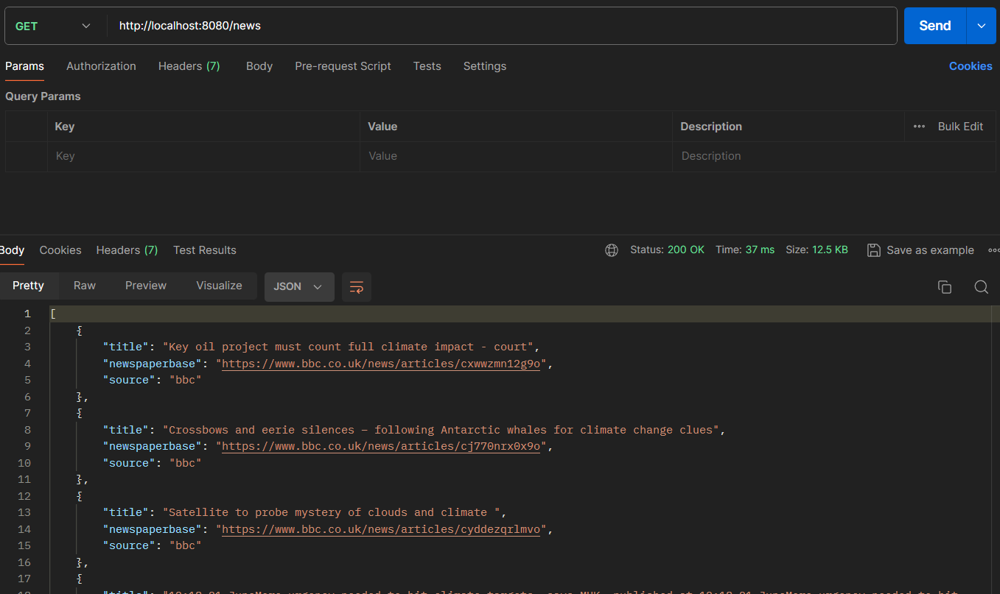
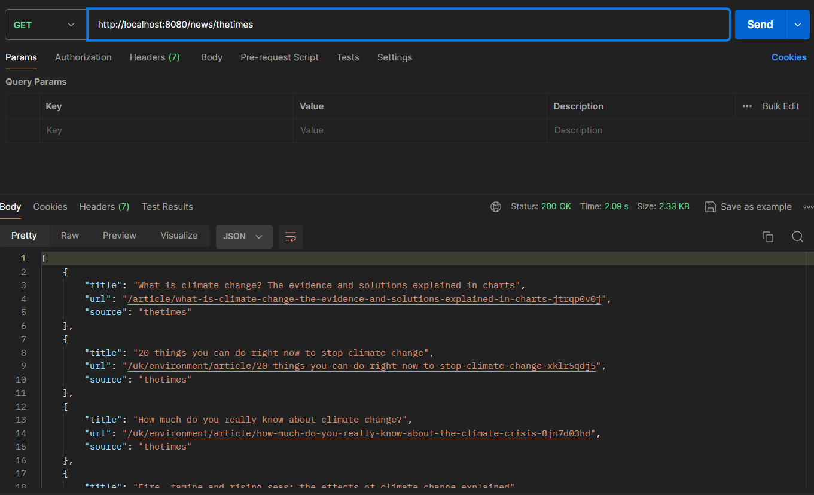

# News Data Webscraping from Popular News Websites

## Description
This project is a simple web scraping tool built with Node.js. It uses Express, Axios, and Cheerio to scrape news data from popular news websites and provides two simple endpoints to return the scraped data in JSON format.

## Technologies Used
- Node.js
- Express
- Axios
- Cheerio

## Installation Instructions
1. Clone the repository:
   ```sh
   git clone https://github.com/yourusername/news-data-webscraping.git
   cd news-data-webscraping

2. Install dependencies:
   ```sh
   npm install
   
3. Start the server:
   ```sh
   npm start

## Screenshots





## Created Date
This project was created on November 14, 2021.
